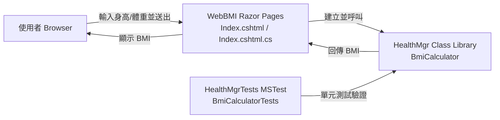
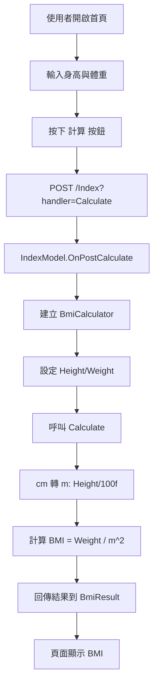

# dotNet8BMISample 系統文件

本專案是一個以 .NET 8 建置的 BMI 範例系統，採用 Razor Pages 作為前端與 Web 層，並將 BMI 計算邏輯獨立在類別庫中，再以 MSTest 進行單元測試。

## 1. 系統目標與範圍

- 提供使用者輸入身高（cm）與體重（kg）後，計算 BMI 值
- 展示分層架構：Web UI / 應用邏輯 / 單元測試
- 示範 .NET 8 解決方案組織方式與測試流程

## 2. 系統架構

### 2.1 架構說明

- `WebBMI`：ASP.NET Core Razor Pages Web 應用，負責畫面與 HTTP 請求處理
- `HealthMgr`：類別庫，封裝 BMI 計算邏輯
- `HealthMgrTests`：單元測試專案，驗證 `HealthMgr` 計算正確性

### 2.2 系統架構圖（Mermaid）



## 3. 專案結構

```text
dotNet8BMISample.sln
|-- WebBMI/                # Razor Pages Web 專案
|   |-- Program.cs
|   |-- Pages/
|   |   |-- Index.cshtml
|   |   `-- Index.cshtml.cs
|   `-- WebBMI.csproj
|-- HealthMgr/             # BMI 核心計算類別庫
|   |-- BmiCalculator.cs
|   `-- HealthMgr.csproj
|-- HealthMgrTests/        # MSTest 測試專案
|   |-- BmiCalculatorTests.cs
|   `-- HealthMgrTests.csproj
`-- TestCase/              # 手動測試文件
		`-- TestCases.md
```

## 4. 功能說明

### 4.1 BMI 計算功能

- 輸入欄位：
	- 身高（`fieldHeight`，單位 cm）
	- 體重（`fieldWeight`，單位 kg）
- 操作流程：按下「計算」按鈕後，透過 `OnPostCalculate()` 呼叫 `BmiCalculator.Calculate()`
- 計算公式：

$$
BMI = \frac{weight\ (kg)}{(height\ (m))^2}
$$

### 4.2 重要修正紀錄（避免計算錯誤）

曾發生 `170 cm / 100` 被整數除法算成 `1` 的問題，導致 BMI 錯誤。現已修正為浮點除法：

- `float height = Height / 100f;`

此修正可正確得到 `1.7` 公尺，進而計算出正確 BMI（如 170/70 約為 24.22）。

## 5. 執行與部署安裝方式

### 5.1 環境需求

- .NET SDK 8.x
- Windows / macOS / Linux 皆可
- 建議使用 Visual Studio 2022 或 VS Code

### 5.2 取得原始碼

```bash
git clone <your-repo-url>
cd dotNet8BMISample
```

### 5.3 還原、建置

```bash
dotnet restore
dotnet build
```

### 5.4 執行 Web 系統

```bash
dotnet run --project WebBMI/WebBMI.csproj
```

預設啟動位址（Development）：

- `https://localhost:7117`
- `http://localhost:5080`

設定來源：`WebBMI/Properties/launchSettings.json`

### 5.5 發行（部署前置）

```bash
dotnet publish WebBMI/WebBMI.csproj -c Release -o ./publish/WebBMI
```

輸出目錄 `publish/WebBMI` 可再交由 IIS、Docker 或雲端服務部署。

## 6. 單元測試說明

### 6.1 測試目標

- 驗證 `BmiCalculator.Calculate()` 在標準輸入（170cm、70kg）下，結果為 `24.22`（小數格式化後）

### 6.2 測試技術

- 測試框架：MSTest
- 套件：
	- `Microsoft.NET.Test.Sdk`
	- `MSTest.TestAdapter`
	- `MSTest.TestFramework`
	- `coverlet.collector`

### 6.3 執行測試

```bash
dotnet test
```

目前狀態：

- `HealthMgrTests` 測試成功（1/1 通過）

### 6.4 後續建議測試案例

- 身高為 0（應避免除以 0）
- 身高或體重為負值（應提示輸入錯誤）
- 非整數輸入（目前欄位綁定為 `int`）

## 7. 主要程式碼逐行說明

以下針對核心程式進行逐行解釋。

### 7.1 `HealthMgr/BmiCalculator.cs`

```csharp
1  namespace HealthMgr
2  {
3      public class BmiCalculator
4      {
5          public int Weight { get; set; }
6          public int Height { get; set; }
7          public float BMI
8          {
9              get
10             {
11                 return Calculate();
12             }
13         }
14
15         public float Calculate()
16         {
17             float result = 0;
18             float height = Height / 100f;
19             result = Weight / (height * height);
20
21             return result;
22         }
23     }
24 }
```

- 第 1 行：宣告命名空間 `HealthMgr`
- 第 3 行：定義 BMI 計算類別 `BmiCalculator`
- 第 5-6 行：宣告體重、身高屬性（整數）
- 第 7-13 行：唯讀屬性 `BMI`，透過 `Calculate()` 動態取得結果
- 第 15 行：宣告回傳 `float` 的計算方法
- 第 17 行：初始化結果變數
- 第 18 行：將公分轉公尺，`100f` 確保使用浮點除法
- 第 19 行：套用 BMI 公式進行計算
- 第 21 行：回傳 BMI 結果

### 7.2 `WebBMI/Pages/Index.cshtml.cs`

```csharp
1  using Microsoft.AspNetCore.Mvc;
2  using Microsoft.AspNetCore.Mvc.RazorPages;
3
4  namespace WebBMI.Pages;
5
6  public class IndexModel : PageModel
7  {
8      private readonly ILogger<IndexModel> _logger;
9      public float BmiResult = 0;
10
11     [BindProperty]
12     public int fieldHeight { get; set; }
13     [BindProperty]
14     public int fieldWeight { get; set; }
15
16     public IndexModel(ILogger<IndexModel> logger)
17     {
18         _logger = logger;
19     }
20
21     public void OnGet()
22     {
23     }
24
25     public void OnPostCalculate()
26     {
27         HealthMgr.BmiCalculator bc = new HealthMgr.BmiCalculator();
28
29         bc.Height = fieldHeight;
30         bc.Weight = fieldWeight;
31
32         BmiResult = bc.Calculate();
33     }
34 }
```

- 第 1-2 行：引用 MVC 與 RazorPages 命名空間
- 第 6 行：頁面模型 `IndexModel`，處理首頁事件
- 第 8 行：注入 logger
- 第 9 行：儲存並回傳給畫面的 BMI 結果
- 第 11-14 行：`BindProperty` 將 HTML 表單值綁定到屬性
- 第 16-19 行：建構子接收相依物件（DI）
- 第 21-23 行：GET 頁面載入事件（目前未處理額外邏輯）
- 第 25 行：`OnPostCalculate` 對應按鈕 post handler
- 第 27 行：建立 BMI 計算器實例
- 第 29-30 行：將表單身高、體重指定給計算器
- 第 32 行：執行計算並把結果存到 `BmiResult`

### 7.3 `WebBMI/Pages/Index.cshtml`

```html
1  @page
2  @model IndexModel
3  @{
4      ViewData["Title"] = "Home page";
5  }
6
7  <div class="container-fluid">
8      <div class="row">
9          <div class="col-md-12">
10             <h5>.net core BMI example</h5>
11         </div>
12     </div>
13     <div class="row">
14         <div class="col-md-6">
15             <form method="post">
16                 @Html.AntiForgeryToken()
17                 <div class="card">
18                     <span class="card-header bg-primary" style="color:white">計算BMI</span>
19                     <div class="card-body">
20                         <label>身高:</label>
21                         <input name="fieldHeight" class="form-control" type="text" value="@Model.fieldHeight" />
22                         <label>體重:</label>
23                         <input name="fieldWeight" class="form-control" type="text" value="@Model.fieldWeight" />
24                         <br />
25                         <button type="submit" asp-page-handler="Calculate" class="btn btn-primary">計算</button>
26                         <label>BMI :  @Model.BmiResult</label>
27                     </div>
28             </form>
29         </div>
30     </div>
31 </div>
```

- 第 1-2 行：宣告 Razor 頁面與綁定的 PageModel
- 第 4 行：設定頁面標題
- 第 15 行：使用 POST 送出表單
- 第 16 行：防偽權杖，避免 CSRF
- 第 21、23 行：身高與體重輸入欄位，欄位名稱對應 `BindProperty`
- 第 25 行：指定 post handler 為 `Calculate`，對應後端 `OnPostCalculate()`
- 第 26 行：顯示計算後的 BMI

### 7.4 `WebBMI/Program.cs`

```csharp
1  var builder = WebApplication.CreateBuilder(args);
2
3  builder.Services.AddRazorPages();
4
5  var app = builder.Build();
6
7  if (!app.Environment.IsDevelopment())
8  {
9      app.UseExceptionHandler("/Error");
10     app.UseHsts();
11 }
12
13 app.UseHttpsRedirection();
14 app.UseStaticFiles();
15 app.UseRouting();
16 app.UseAuthorization();
17 app.MapRazorPages();
18 app.Run();
```

- 第 1 行：建立 WebApplication builder
- 第 3 行：註冊 Razor Pages 服務
- 第 5 行：建立 app 管線
- 第 7-11 行：非開發環境下啟用全域錯誤處理與 HSTS
- 第 13 行：HTTP 轉導到 HTTPS
- 第 14 行：啟用靜態檔案（CSS/JS）
- 第 15 行：啟用路由
- 第 16 行：啟用授權中介軟體
- 第 17 行：映射 Razor Pages 路由
- 第 18 行：啟動應用程式

### 7.5 `HealthMgrTests/BmiCalculatorTests.cs`

```csharp
1  [TestClass()]
2  public class BmiCalculatorTests
3  {
4      [TestMethod()]
5      public void CalculateTest()
6      {
7          HealthMgr.BmiCalculator bmi = new HealthMgr.BmiCalculator();
8          bmi.Height = 170;
9          bmi.Weight = 70;
10
11         var result = bmi.Calculate();
12
13         Assert.AreEqual("24.22", result.ToString("00.00"));
14     }
15 }
```

- 第 1 行：標記此類別為測試類別
- 第 4 行：標記測試方法
- 第 7-9 行：建立測試資料（170cm, 70kg）
- 第 11 行：執行待測方法
- 第 13 行：驗證格式化後結果等於 `24.22`

## 8. 作業流程圖（Mermaid）



## 9. 已知限制與改進建議

- 目前未對 0、負數、非合理範圍輸入進行防呆
- 目前未顯示 BMI 分類（過輕、正常、過重、肥胖）
- 建議加入 `ModelState` 驗證與錯誤訊息
- 建議新增更多單元測試與整合測試

## 10. 快速操作指令

```bash
# 建置
dotnet build

# 執行 Web
dotnet run --project WebBMI/WebBMI.csproj

# 執行測試
dotnet test

# 發行
dotnet publish WebBMI/WebBMI.csproj -c Release -o ./publish/WebBMI
```
